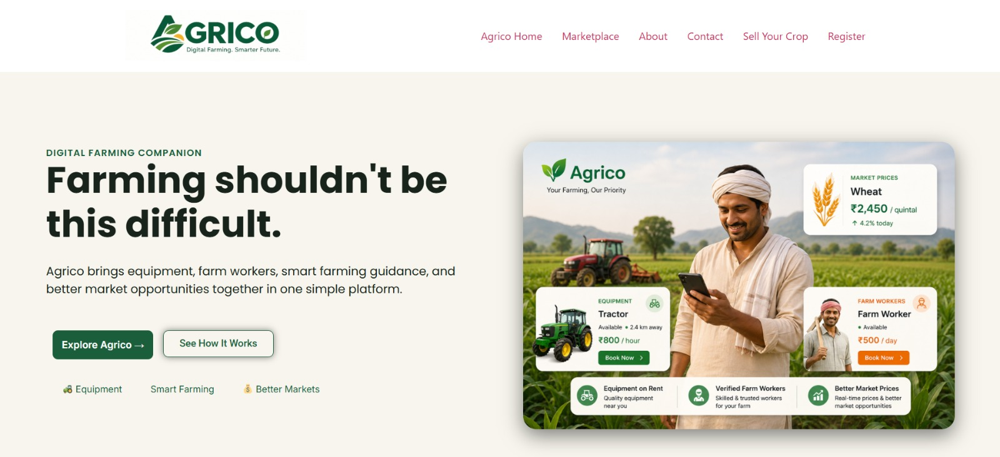
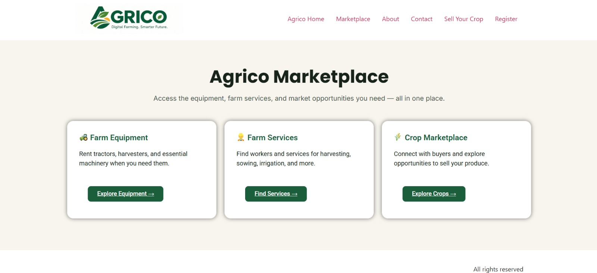
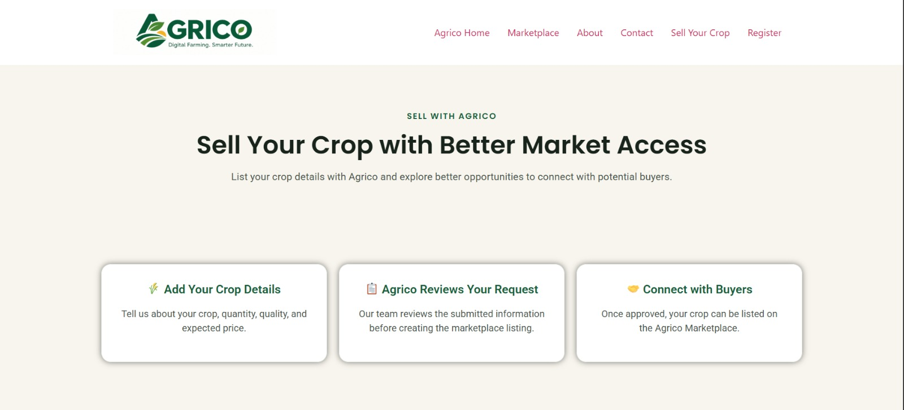
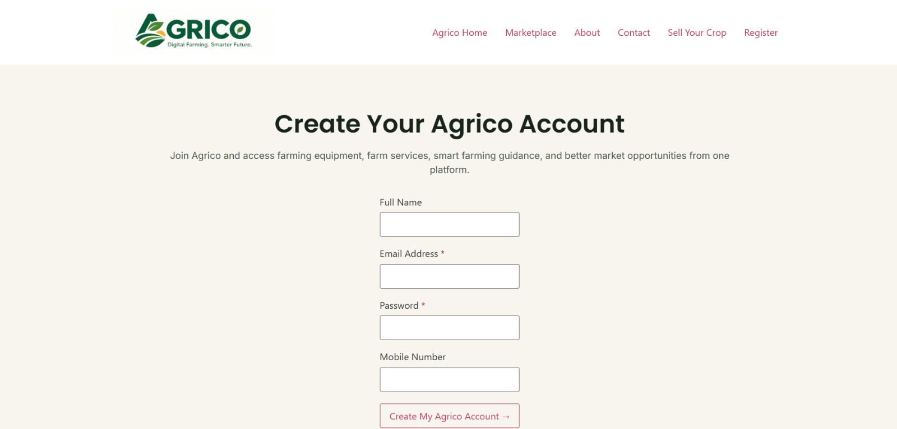
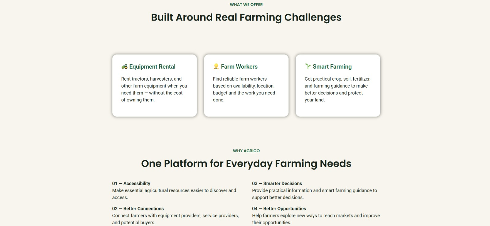

# AGRICO-Digital-Farming
A WordPress-based digital farming companion connecting farmers with farm equipment, services, and crop marketplace.

# 🌱 AGRICO – Digital Farming Companion

AGRICO is a WordPress-based digital farming companion designed to bring
farm equipment, farm services, crop selling, and useful farming information
together on one simple platform.

## 🌾 Problem Statement

Farmers can face difficulties in finding farm equipment, accessing farm
services, and selling their crops through convenient platforms.

AGRICO aims to bring these needs together in one accessible digital platform.

## 💡 Solution

AGRICO provides a simple platform where farmers can:

- 🚜 Explore farm equipment
- 🧑‍🌾 Explore farm services
- 🌾 Submit crops for marketplace listing
- 👤 Manage activities through a Farmer Dashboard
- 📊 Access Smart Farming information

## ✨ Key Features

- Farmer Registration
- Farmer Dashboard
- Farm Equipment Marketplace
- Farm Services
- Crop Marketplace
- Sell Your Crop form
- WooCommerce integration
- Automatic crop listing workflow
- Responsive website design

## 🛠️ Technologies Used

- WordPress
- Elementor
- WooCommerce
- Forminator
- Custom PHP
- CSS

## 📸 Project Screenshots

### Homepage

### Marketplace

### Sell Your Crop

### Registration

### About AGRICO

## 🌐 Live Website

https://namrata.blog/

## 📄 Project Documentation

The complete project documentation is available here:

[View AGRICO Project Documentation](documentation/AGRICO_Project_Documentation.pdf)

## 🎯 Project Objective

The objective of AGRICO is to make common farming-related services and
resources easier to discover and access through a single digital platform.

## 👩‍💻 Developer

**Namrata Kachare**

AGRICO — Digital Farming. Smarter Future. 🌱
